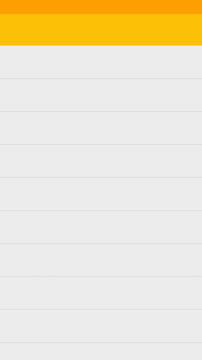
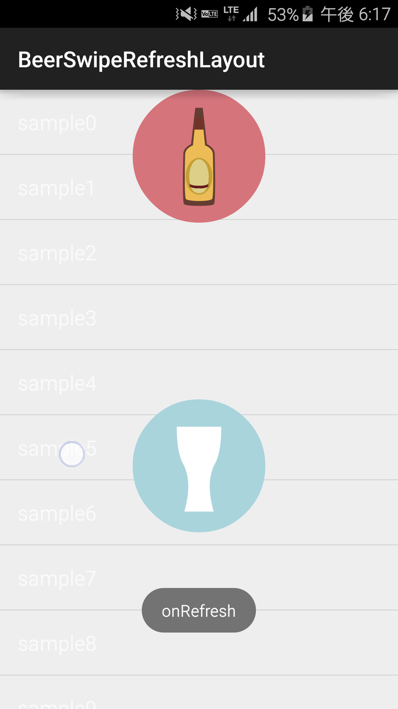
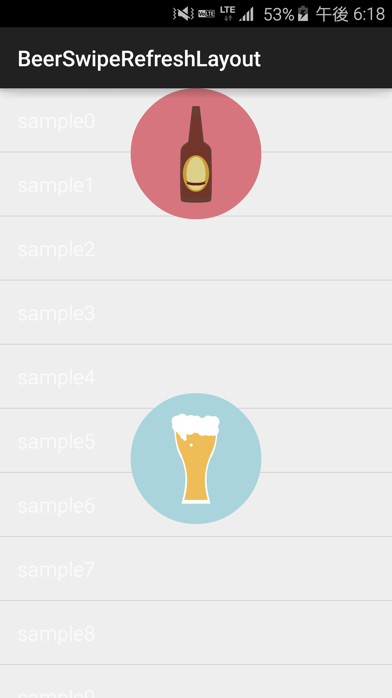

# BeerSwipeRefreshLayout

[](https://github.com/recruit-lifestyle/BeerSwipeRefresh)
[]()  
This project aims to provide a reusable Swipe to Refresh widget for Android.


##Screenshots
*Watch YouTube video [here](https://www.youtube.com/watch?v=ZIBP56GboX0).*  
  




## Requirements
Target Sdk Version : 21  
Min Sdk Version : 19  

##How to use
1) Add this to your **build.gradle**.
```java
repositories {
    maven {
        url "https://jitpack.io"
    }
}

dependencies {
  compile 'com.github.recruit-lifestyle:BeerSwipeRefresh:1.1'
}
```  

2) Add  ```java com.list.view.amyu.beerswiperefreshlayout.BeerSwipeRefreshLayout``` , which has at least one AbsListView, to your layout XML file.
```java
<jp.co.recruit_lifestyle.android.widget.BeerSwipeRefreshLayout
        android:layout_width="match_parent"
        android:layout_height="match_parent"
        android:id="@+id/main_swipe">

      <ListView
          android:id="@+id/main_list"
          android:layout_width="match_parent"
          android:layout_height="match_parent"/>

</jp.co.recruit_lifestyle.android.widget.BeerSwipeRefreshLayout>
```  

3) Add the function so that the your application knows when a user has completed a 'BeerSwipeRefreshLayout'.
```java
mBeerSwipeRefreshLayout = (BeerSwipeRefreshLayout) findViewById(R.id.main_swipe);
mBeerSwipeRefreshLayout.setOnRefreshListener(new BeerSwipeRefreshLayout.OnRefreshListener() {
  @Override public void onRefresh() {
    // Do work to refresh the list here.
    new Task().execute();
  }
});

private class Task extends AsyncTask<Void, Void, String[]> {
  ...
  @Override protected void onPostExecute(String[] result) {
    // Call setRefreshing(false) when the list has been refreshed.
    mBeerSwipeRefreshLayout.setRefreshing(false);
    super.onPostExecute(result);
  }
}
```

## Credits

BeerSwipeRefreshLayout is owned and maintained by [RECRUIT LIFESTYLE CO., LTD.](http://www.recruit-lifestyle.co.jp/)

BeerSwipeRefreshLayout was originally created by [Yuki Mima](https://github.com/amyu)  


##License

    Copyright 2015 RECRUIT LIFESTYLE CO., LTD.

    Licensed under the Apache License, Version 2.0 (the "License");
    you may not use this file except in compliance with the License.
    You may obtain a copy of the License at

       http://www.apache.org/licenses/LICENSE-2.0

    Unless required by applicable law or agreed to in writing, software
    distributed under the License is distributed on an "AS IS" BASIS,
    WITHOUT WARRANTIES OR CONDITIONS OF ANY KIND, either express or implied.
    See the License for the specific language governing permissions and
    limitations under the License.
